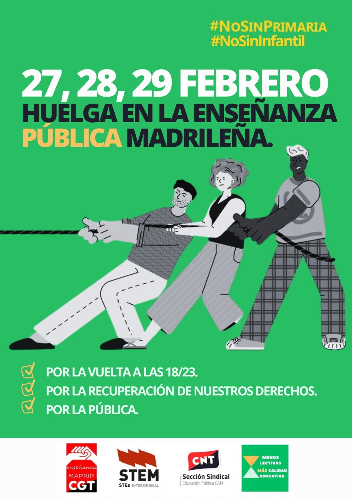

# INFORMACIÓN Y ENLACES A LAS ASAMBLEAS DE LA ZONA SUR Y ASAMBLEA GENERAL 
[ENLACE A LA WEB DE MENOS LECTIVAS](https://sites.google.com/view/menoslectivas/inicio?fbclid=PAAaaqWAbWZwA0s3rgv9F3sp_PvYYOQWqU_nt5EED4Tb0_pllt68GAWjk8tj0)

[ENLACE DIRECTO A TODOS LOS DOCUMENTOS DE LA CAMPAÑA 18_23](https://docs.google.com/document/d/1Q08LgGZRj7RZ8u_8xzcPUhxvCBtdeepL/edit)

## [3 DE ABRIL EN EL GGM]
- Fijarnos en luchas como la de ACERINOX (58 días en huelga), que por supuesto, no sale en los "medios de comunicación"
[https://www.europasur.es/los_barrios/Acerinox-comite-huelga-negociacion-convenio_0_1886513579.html]
(https://www.youtube.com/watch?v=CWtThocu-m8)
- Plantear en la asamblea general el sacar un escrito de reconocimiento y apoyo a huelgas y luchas como la de ACERINOX (en la que deberíamos fijarnos)
- ¿Hay propuestas para el inicio de curso en Septiembre? --> En las actas de la asamblea general aparecen varios comentarios sobre esto
- ¿Como vemos hacer pseudo-piquetes informativos en los centros desmovilizados en los alrededores de centros donde si que hay movilizaciones?
- Salir al patio en algún recreo y hacer pancartas para que los alumnos sepan de que va la historia.

  

